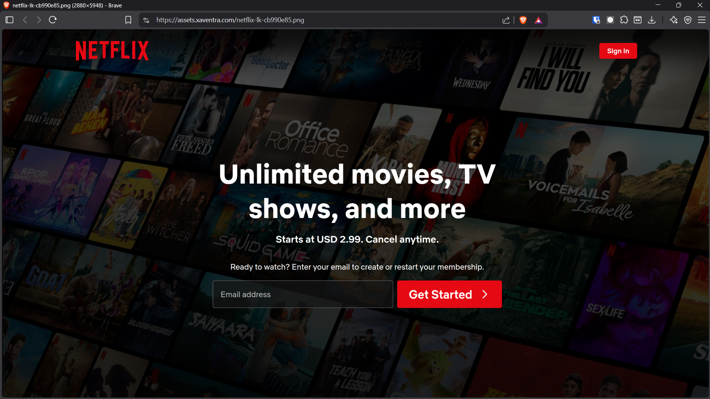
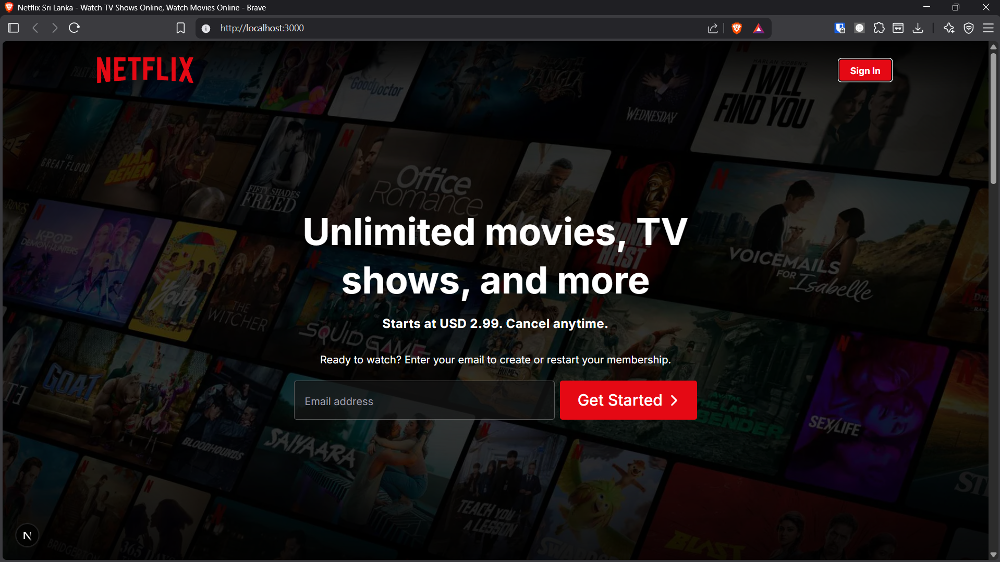
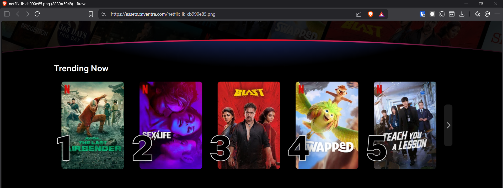
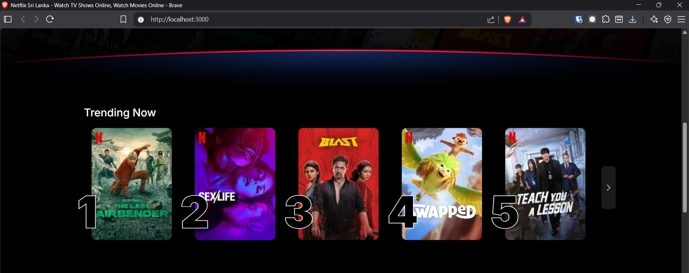
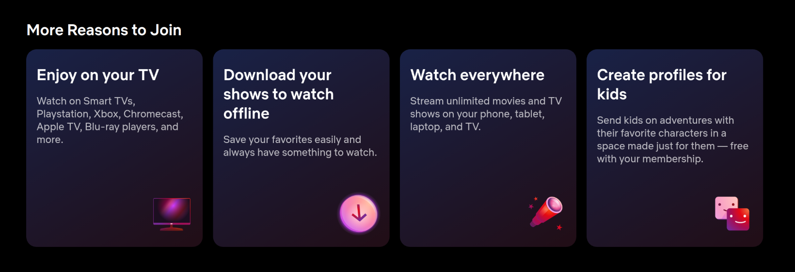
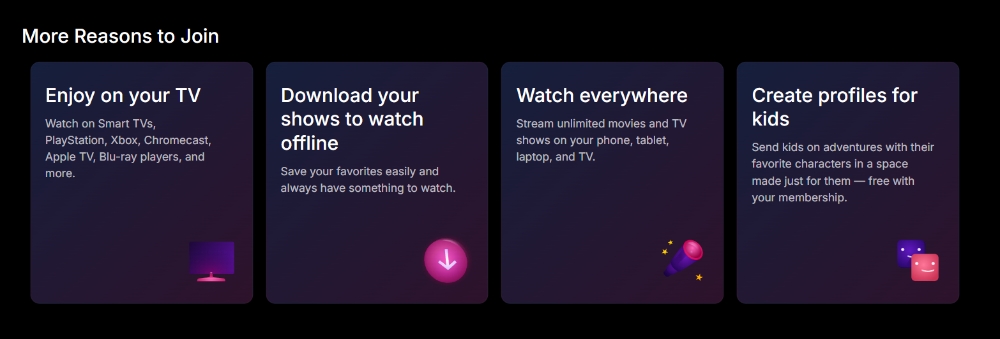
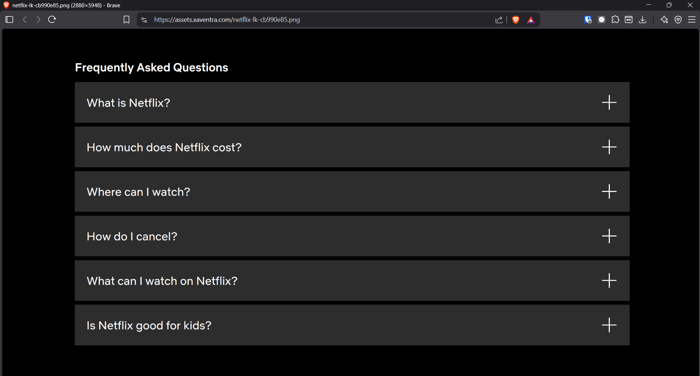
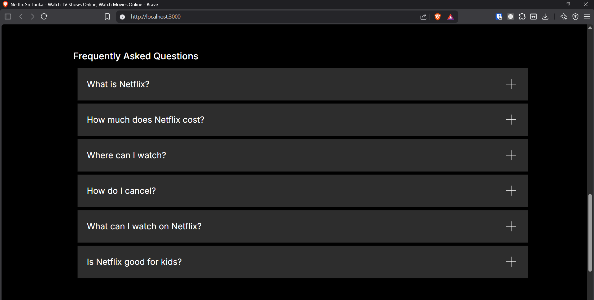
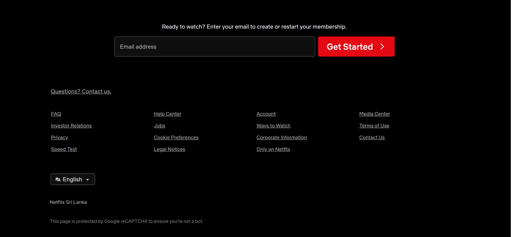
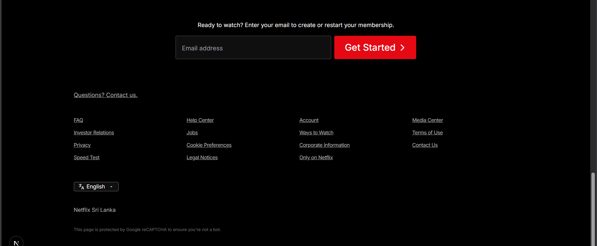

# Netflix Sri Lanka Homepage Clone - XAVENTRA Technical Assessment

## Project Overview

This project is a high-fidelity, responsive clone of the Netflix Sri Lanka homepage, developed as part of the XAVENTRA Technical Assessment. The primary objective was to accurately recreate the complex layout, specific design language, and responsive behaviors of the Netflix interface using modern web technologies. 

## Technology Stack

*   **Next.js (React):** Chosen for its robust component-based architecture and built-in optimization features. Next.js provided a scalable foundation for managing complex UI sections, such as the Trending and FAQ sections, through modular and reusable components.
*   **Tailwind CSS:** Selected for its utility-first approach, which was essential for executing the highly specific pixel adjustments, intricate gradient overlays, and complex responsive breakpoints required to match the Netflix UI without managing bloated external stylesheets.
*   **TypeScript:** Implemented to ensure type safety, improve maintainability, and prevent runtime errors when passing data across UI components.

## Local Setup Instructions

To run this project locally, please follow these steps:

1.  Clone this repository to your local machine.
2.  Navigate to the project directory via your terminal.
3.  Install the necessary dependencies:
    ```bash
    npm install
    ```
4.  Start the development server:
    ```bash
    npm run dev
    ```
5.  Open [http://localhost:3000](http://localhost:3000) in your browser to view the application.

## Development Time

This project was completed in **5 hours**, encompassing initial environment setup, layout structuring, styling, and final responsive adjustments.

## Technical Limitations & Deviations (What I Know Isn't 100%)

I pushed my skills to the absolute limit to build a 1:1 clone that is as humanly identical as possible, pouring everything I know about frontend engineering into every pixel. However, given my current depth of knowledge, experience level, and lack of access to Netflix's internal servers, a few tiny elements deviate slightly from the original:

1.  **Proprietary 3D Assets:** The icons in the "More Reasons to Join" section on the official Netflix site are custom, proprietary 3D-rendered images hosted on their private Content Delivery Network (CDN). To avoid hotlinking proprietary assets, alternative CSS and standard SVG approaches were utilized to mimic the structural layout.
2.  **Typography (Netflix Sans):** Netflix utilizes a highly guarded, custom typeface called "Netflix Sans." This project relies on standard, clean sans-serif web fonts such as Inter as fallbacks. Consequently, there are microscopic variances in character widths, font weights, and line heights.
3.  **Gradient and Image Compression:** The exact gradient blending on the real site is tuned specifically for their highly compressed background imagery. While our CSS gradient stops are mathematically accurate, slight visual banding or contrast differences may occur depending on the specific source imagery used.

## Future Improvements

Given an additional hour of development time, I would prioritize the following enhancements:

*   **Asset Sourcing:** Source or recreate exact replica image assets for the "Reasons to Join" section to achieve complete visual parity.
*   **Accessibility (a11y) Polish:** Implement comprehensive keyboard navigation and strict ARIA accessibility labels across all interactive elements, specifically targeting the FAQ accordion and horizontal scrolling interfaces.
*   **Micro-interactions:** Introduce subtle entrance animations or parallax effects as UI elements scroll into the viewport to further elevate the premium feel of the interface.

## Side-by-Side Comparison

Below is a visual comparison between the original Netflix homepage and this clone during development.

| Section | Original Netflix Homepage | Developed Clone |
| :--- | :--- | :--- |
| **Hero Section** |  |  |
| **Trending Section** |  |  |
| **Reasons to Join** |  |  |
| **FAQ Section** |  |  |
| **Footer Section** |  |  |
